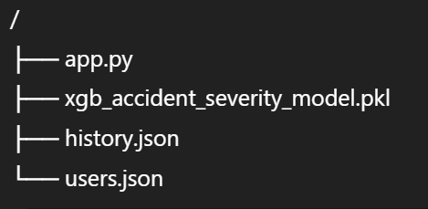
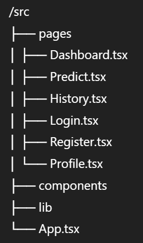

# 🚦 Road Safety Predictor

## 1. Project Overview

The **Road Safety Predictor** is a full-stack web application designed to predict **accident severity** based on road, traffic, and environmental conditions.  
It combines a **modern React frontend** with a **machine-learning–powered Flask backend** using an **XGBoost model**.

The system allows users to:
- Enter accident-related parameters
- Receive a severity risk score (0–100%)
- Maintain prediction history
- Register and log in using basic authentication

---

## 2. Technology Stack

### 🔙 Backend
- **Language:** Python  
- **Framework:** Flask, Flask-CORS  
- **Machine Learning:** XGBoost (`xgb_accident_severity_model.pkl`), scikit-learn, joblib  
- **Data Processing:** Pandas, NumPy  
- **Storage:** Local JSON files (`history.json`, `users.json`)  
- **Database:** None (file-based persistence)

### 🎨 Frontend
- **Framework:** React (Vite)
- **Language:** TypeScript
- **UI Library:** shadcn-ui (Radix UI based)
- **Styling:** Tailwind CSS, Tailwind Merge, Class Variance Authority
- **State & Data Fetching:** React Query (`@tanstack/react-query`)
- **Routing:** React Router DOM
- **Icons:** Lucide React
- **Form Validation:** Zod + React Hook Form

---

## 3. Architecture & Project Structure

### 📁 Backend Structure (`/`)

#### Backend Responsibilities
- REST API endpoint handling
- ML model loading and inference
- Input preprocessing and feature engineering
- JSON-based data persistence

#### API Endpoints
- `GET /` – Health check  
- `POST /api/register` – User registration  
- `POST /api/login` – User authentication  
- `POST /api/predict` – Accident severity prediction  
- `GET /api/history` – Retrieve prediction history  

#### Preprocessing Pipeline
- Binary encoding (`Yes/No`)
- Numeric coercion and validation
- Cyclic time encoding (sin/cos)
- One-hot encoding for categorical features
- Feature alignment for XGBoost inference

---

### Frontend Structure

#### Frontend Responsibilities
- User input collection and validation
- API communication with backend
- Prediction visualization
- Authentication flow
- Prediction history display

---

## 4. Key Features

- **Accident Severity Prediction**  
  Predicts severity risk as a percentage (0–100%) using an XGBoost model.

- **User Authentication**  
  Email and password-based registration and login.

- **Prediction History Tracking**  
  Stores input data, processed features, prediction values, and timestamps.

- **Modern UI & UX**  
  Clean, responsive interface built using Tailwind CSS and component-based design.

---

## 5. Deployment Information

- **Backend:** Docker-ready Flask application  
- **Frontend Hosting:** GitHub Pages (`gh-pages`)  
- **Environment Configuration:** `.env` supported for runtime variables  

---

## 6. Recommendations & Observations

### Data Persistence
- JSON file storage is suitable for development and demos.
- For production use, migration to a database such as SQLite or PostgreSQL is recommended.

### Security Considerations
- Passwords are currently stored in plain text.
- **Critical Improvement Needed:** Implement password hashing using libraries such as `bcrypt` or `werkzeug.security`.

### Configuration Management
- Environment variables are used appropriately for configuration control.

---

## 7. Resolved Issues Summary

### Connectivity Issue (Hardcoded IP)
**Problem:** Frontend used a hardcoded private IP address, causing backend connection failures.  
**Solution:** Refactored all API calls to use `http://localhost:5000`.

---

### Navigation Error (404 on Refresh)
**Problem:** React Router failed when refreshing pages due to incorrect base path.  
**Solution:** Configured `basename="/my_road_safety_predictor"` in `App.tsx`.

---

### Backend Crash (Unicode Logging Error)
**Problem:** Flask crashed on Windows due to Unicode emoji characters in logs.  
**Solution:** Removed Unicode characters from backend logging statements.

---

### Stale Python Processes
**Problem:** Code changes were not reflected due to lingering background Python processes.  
**Solution:** Terminated all running Python processes before restarting the server.

---

## 8. Project Status

- ✔ Functional end-to-end ML pipeline  
- ✔ Frontend–backend integration complete  
- ✔ Modular and extensible architecture  
- ⚠ Security and persistence enhancements recommended for production deployment  

---

## 9. Future Enhancements

- Secure password hashing and token-based authentication
- Database integration for scalability
- Model explainability (SHAP)
- Role-based access control
- Cloud deployment (AWS / GCP)

---

## 10. Author

**Komendra Sahu**  
M.Tech – Data Science & Artificial Intelligence  

---

## 11. License

This project is intended for educational and research purposes.
